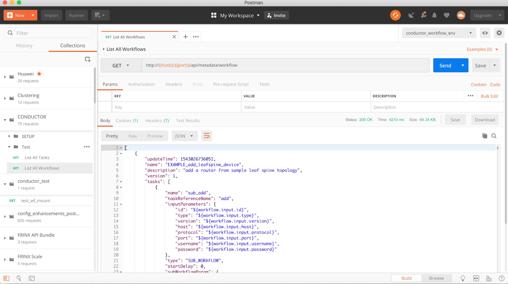
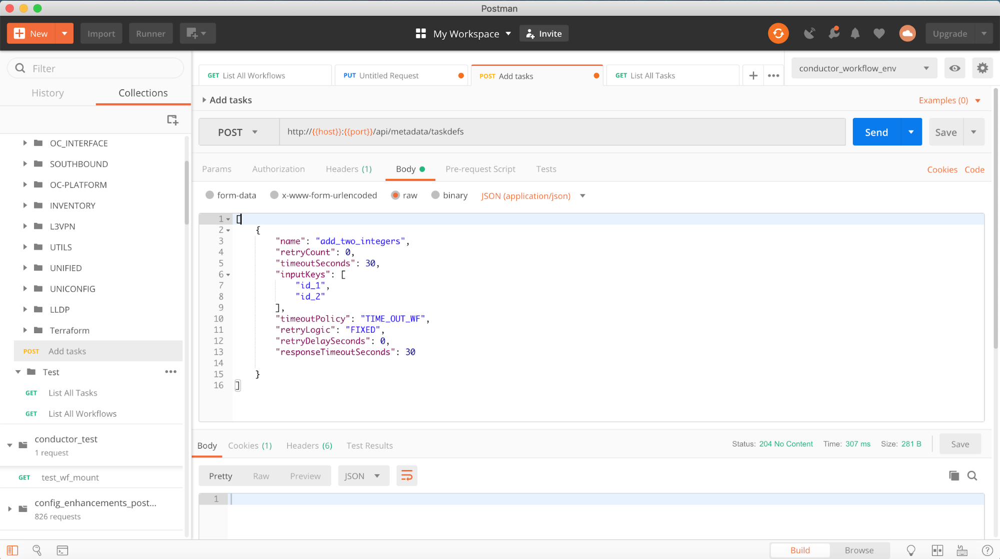

# FRINX Machine Documentation


# Create and Modify Workflows


## Prepare Your Work Environment

After you have installed and started FRINX Machine (see "https://github.com/FRINXio/FRINX-machine") you will want to modify existing workflows or add new workflows to meet your needs. We will be referring to the machine that is running the FRINX Machine containers as host. Typically that host is a VM running on your laptop, in your private cloud or in a public/virtual private cloud. Here is how to get started.

Go to the directory on your host in which you have cloned the FRINX Machine repository. In our case this is 


```
gwieser@gns3vm:~/FRINX-machine$ ls -al
total 88
drwxrwxr-x 12 gwieser gwieser 4096 Nov 23 23:38 .
drwxr-xr-x 15 gwieser gwieser 4096 Nov 24 00:03 ..
drwxrwxr-x  4 gwieser gwieser 4096 Nov 23 23:38 base_images
drwxrwxr-x 19 gwieser gwieser 4096 Nov 23 23:40 conductor
-rwxrwxr-x  1 gwieser gwieser  151 Nov 23 23:38 docker-compose.min.yml
-rwxrwxr-x  1 gwieser gwieser 2514 Nov 23 23:38 docker-compose.yml
drwxrwxr-x  2 gwieser gwieser 4096 Nov 23 23:38 dynomite
drwxrwxr-x  2 gwieser gwieser 4096 Nov 23 23:38 elasticsearch
-rw-rw-r--  1 gwieser gwieser   25 Nov 23 23:38 .env
drwxrwxr-x  2 gwieser gwieser 4096 Nov 23 23:38 frinxit
drwxrwxr-x  9 gwieser gwieser 4096 Nov 23 23:38 .git
-rw-rw-r--  1 gwieser gwieser  390 Nov 23 23:38 .gitmodules
-rwxrwxr-x  1 gwieser gwieser 3904 Nov 23 23:38 health_check.sh
-rwxrwxr-x  1 gwieser gwieser 1955 Nov 23 23:38 install.sh
drwxrwxr-x  2 gwieser gwieser 4096 Nov 23 23:38 kibana
drwxrwxr-x  3 gwieser gwieser 4096 Nov 23 23:38 microservices
drwxrwxr-x  4 gwieser gwieser 4096 Nov 23 23:38 odl
-rw-rw-r--  1 gwieser gwieser 3830 Nov 23 23:38 README.md
drwxrwxr-x  3 gwieser gwieser 4096 Nov 23 23:38 sample-topology
-rwxrwxr-x  1 gwieser gwieser 1910 Nov 23 23:38 startup.sh
-rwxrwxr-x  1 gwieser gwieser  135 Nov 23 23:38 teardown.sh
-rwxrwxr-x  1 gwieser gwieser 4080 Nov 23 23:38 wait_for_it.sh
gwieser@gns3vm:~/FRINX-machine$
```

To prepare the development environment on your host go to the FRINX-machine directory and enter:

```
sudo apt-get install python-setuptools
```
```
cd conductor/client/python/
```
```
sudo python setup.py install
```

Go to the folder that includes the python workers that are used for the workflow execution logic. 


```
gwieser@gns3vm:~/FRINX-machine$ cd microservices/netinfra_utils/workers/
gwieser@gns3vm:~/FRINX-machine/microservices/netinfra_utils/workers$ ls -al
total 180
drwxrwxr-x 3 gwieser gwieser  4096 Nov 24 00:04 .
drwxrwxr-x 3 gwieser gwieser  4096 Nov 23 23:39 ..
-rw-rw-r-- 1 gwieser gwieser 11835 Nov 23 23:39 cli_worker.py
-rw-rw-r-- 1 gwieser gwieser  9469 Nov 24 00:04 cli_worker.pyc
-rw-rw-r-- 1 gwieser gwieser   667 Nov 24 00:03 frinx_rest.py
-rw-rw-r-- 1 gwieser gwieser   921 Nov 24 00:04 frinx_rest.pyc
drwxrwxr-x 2 gwieser gwieser  4096 Nov 23 23:39 .idea
-rw-rw-r-- 1 gwieser gwieser 11134 Nov 23 23:39 inventory_worker.py
-rw-rw-r-- 1 gwieser gwieser  8725 Nov 24 00:04 inventory_worker.pyc
-rw-rw-r-- 1 gwieser gwieser 10876 Nov 23 23:39 l3vpn_worker.py
-rw-rw-r-- 1 gwieser gwieser  7630 Nov 24 00:04 l3vpn_worker.pyc
-rw-rw-r-- 1 gwieser gwieser  5569 Nov 23 23:39 lldp_worker.py
-rw-rw-r-- 1 gwieser gwieser  4554 Nov 24 00:04 lldp_worker.pyc
-rw-rw-r-- 1 gwieser gwieser   721 Nov 23 23:39 main.py
-rw-rw-r-- 1 gwieser gwieser  1284 Nov 23 23:39 platform_worker.py
-rw-rw-r-- 1 gwieser gwieser  1616 Nov 24 00:04 platform_worker.pyc
-rw-rw-r-- 1 gwieser gwieser  6365 Nov 23 23:39 terraform_worker.py
-rw-rw-r-- 1 gwieser gwieser  6315 Nov 24 00:04 terraform_worker.pyc
-rw-rw-r-- 1 gwieser gwieser 13780 Nov 23 23:39 uniconfig_worker.py
-rw-rw-r-- 1 gwieser gwieser 10557 Nov 24 00:04 uniconfig_worker.pyc
-rw-rw-r-- 1 gwieser gwieser  7658 Nov 23 23:39 unified_worker.py
-rw-rw-r-- 1 gwieser gwieser  6374 Nov 24 00:04 unified_worker.pyc
-rw-rw-r-- 1 gwieser gwieser   338 Nov 23 23:39 workers.iml
gwieser@gns3vm:~/FRINX-machine/microservices/netinfra_utils/workers$
```

Go to the file "frinx_rest.py" and make the following changes (highlighted text). If the file can't be written to you might have erroneously run the install as sudo. Make sure you run the FRINX Machine install script as regular user, without sudo, and you will be able to edit and save the microservice files.  

```
import json

#odl_url_base = "http://odl:8181/restconf"
#elastic_url_base = "http://elasticsearch:9200"
#conductor_url_base = "http://conductor-server:8080/api"

odl_url_base = "http://localhost:8181/restconf"
elastic_url_base = "http://localhost:9200"
conductor_url_base = "http://localhost:8080/api"


odl_credentials = ("admin", "admin")
odl_headers = {"Content-Type": "application/json"}

def parse_response(r):
    decode = r.content.decode('utf8')
    try:
        response_json = json.loads(decode if decode else "{}")
    except ValueError as e:
        response_json = json.loads("{}")

    response_code = r.status_code
    return response_code, response_json
```

_Note, that "localhost" is the hostname of FRINX Machine host VM. In case you are running and developing the workers remotely, use the IP address of FRINX Machine host instead of "localhost"._  

**The changes that you have made in the file above will result in executing the worker tasks on your host (the machine running the FRINX Machine containers) instead of in the microservice container. Save the file with the changes and start the python workers on your host with the following command:**


```
gwieser@gns3vm:~/FRINX-machine/microservices/netinfra_utils/workers$ python main.py
```


You will see a similar output like shown below, which indicates that the workers are now running and are ready for execution.


```
[...]
Polling for task UNICONFIG_write_structured_device_data at a 100.000000 ms interval with 1 threads for task execution, with worker id as gns3vm
Polling for task UNICONFIG_delete_structured_device_data at a 100.000000 ms interval with 1 threads for task execution, with worker id as gns3vm
Polling for task UNICONFIG_commit at a 100.000000 ms interval with 1 threads for task execution, with worker id as gns3vm
Polling for task UNICONFIG_dryrun_commit at a 100.000000 ms interval with 1 threads for task execution, with worker id as gns3vm
Polling for task UNICONFIG_calculate_diff at a 100.000000 ms interval with 1 threads for task execution, with worker id as gns3vm
Polling for task UNICONFIG_sync_from_network at a 100.000000 ms interval with 1 threads for task execution, with worker id as gns3vm
Polling for task UNICONFIG_replace_config_with_oper at a 100.000000 ms interval with 1 threads for task execution, with worker id as gns3vm
Starting Terraform workers
Polling for task TERRAFORM_apply at a 100.000000 ms interval with 1 threads for task execution, with worker id as gns3vm
Polling for task TERRAFORM_plan at a 100.000000 ms interval with 1 threads for task execution, with worker id as gns3vm
Polling for task TERRAFORM_destroy at a 100.000000 ms interval with 1 threads for task execution, with worker id as gns3vm
[...]
```


The final (optional) step is to stop the microservice container "micro". You only need to stop the microservice container if you want to modify existing workers. If you create entirely new workers, this step is not necessary.


```
gwieser@gns3vm:~/FRINX-machine$ sudo docker-compose stop micro
Stopping micros ... done
gwieser@gns3vm:~/FRINX-machine$
sudo docker-compose stop micro
```


FRINX Machine is now using the workers running on your host instead of the workers running in the FRINX Machine container. This allows you to modify existing workers and add new workers to your workflows directly on your host.

New workflows and tasks are created through the REST API of Conductor. We use Postman or Newman to retrieve and create new tasks and workflows. Here is how you import our collections in your Postman application. You can import our sample workflows and tasks from github. Make sure that you use "raw" links so that Postman can import the collections.

Conductor Workflow and Tasks - Postman Collection 

[https://raw.githubusercontent.com/FRINXio/FRINX-machine/master/microservices/netinfra_utils/postman.json]
(https://raw.githubusercontent.com/FRINXio/FRINX-machine/master/microservices/netinfra_utils/postman.json)

Postman Environment

[https://raw.githubusercontent.com/FRINXio/FRINX-machine/master/microservices/netinfra_utils/postman_environment.json]
(https://raw.githubusercontent.com/FRINXio/FRINX-machine/master/microservices/netinfra_utils/postman_environment.json)

Import both links in Postman as shown here:


Now select the conductor_workflow_env from the dropdown list and if necessary change the host variable to point to the host running FRINX Machine.


You should now be ready to retrieve, modify and create workflows and tasks in conductor from your Postman application. The following example shows how you can retrieve all existing workflows from the conductor server.

In the CONDUCTOR collection that you imported in the previous step, go to the "Test" folder and select "List All Workflows". Click on send and conductor server will reply with all workflows it has stored. 




## Create a New Workflow

Now that we have our environment prepared, we can create the first simple workflow. The goal is to have the first task in our workflow receive two input parameters (id1 and id2). The purpose of our task is to add the two input variables and return the result. The execution logic of our task will be implemented in a small python function.  

The second task in our workflow will be a http call to a test API. We will use the output of the first task to select the id of our test function. E.g. If the output of our first task is "5" then our second task should go to the following URL: [https://jsonplaceholder.typicode.com/posts/5](https://jsonplaceholder.typicode.com/posts/5)  
If the output of our first task is 6 then the second task should call [https://jsonplaceholder.typicode.com/posts/6](https://jsonplaceholder.typicode.com/posts/6)

The output of our workflow will be the value of a parameter in the response from our test function called "title". 

For a full documentation of tasks, workflows and the capabilities of Netflix Conductor, please go to  [https://netflix.github.io/conductor/](https://netflix.github.io/conductor/)

Workflows consist of one or multiple tasks. Conductor supports two different kind of tasks: _systems tasks_ that are executed within the conductor server JVM and _worker tasks_ that are running outside of the conductor JVM.

Conductor maintains a registry of worker task types. A worker task type MUST be registered before using in a workflow. In the following example we register a new worker task. We use POST to create a new task and we use PUT to update an existing task. 


```
POST /api/metadata/taskdefs HTTP/1.1
Host: 192.168.1.51
Content-Type: application/json
cache-control: no-cache
Postman-Token: 9cd87d64-679f-49e2-8873-6459d26b8033
[
	{
        "name": "add_two_integers",
        "retryCount": 0,
        "timeoutSeconds": 30,
        "inputKeys": [
            "id_1",
            "id_2"
        ],
        "timeoutPolicy": "TIME_OUT_WF",
        "retryLogic": "FIXED",
        "retryDelaySeconds": 0,
        "responseTimeoutSeconds": 30


	}
]
```


You can use any http tool (e.g. curl, …) to create the new task in Conductor via its API. The following example shows how to create the task in Conductor with Postman.



For our second task, we will use an existing system task called "htttp_get_generic". This task exists already in our library and uses the http system task function. You do not have to create it, it is already in our collection. Its definition looks like this.


```
    {
        "createTime": 1543026743415,
        "name": "http_get_generic",
        "retryCount": 3,
        "timeoutSeconds": 10,
        "timeoutPolicy": "TIME_OUT_WF",
        "retryLogic": "FIXED",
        "retryDelaySeconds": 5,
        "responseTimeoutSeconds": 10
    }
```


Now we can create our first workflow by stringing together the two tasks in sequence. We use the following definition for our workflow. Use POST for creation and PUT for updates.


```
POST /api/metadata/workflow HTTP/1.1
Host: 192.168.1.51
Content-Type: application/json
cache-control: no-cache
Postman-Token: 488d57ec-cf1d-447c-8cfc-9ea28505b98e
[
{
  "name": "EXAMPLE_add_integers_and_GET_HTTP",
  "description": "Adds two integers it receives from input and calls a sample API",
  "version": 1,
  "tasks": [
    {
      "name": "add_two_integers",
      "taskReferenceName": "add_two_integers_1st_instance",
      "inputParameters": {
        "id1": "${workflow.input.id1}",
        "id2": "${workflow.input.id2}"
      },
      "type": "SIMPLE",
      "startDelay": 0
    },    
    {
      "name": "http_get_generic",
      "taskReferenceName": "http_get_generic_1st_instance",
      "inputParameters": {
        "http_request": {
          "uri": "https://jsonplaceholder.typicode.com/posts/${add_two_integers_1st_instance.output.result}",
          "method": "GET"
        }
      },
      "type": "HTTP",
      "startDelay": 0
    }
  ],
  "inputParameters": [
    "id1[This is the first addend of the addition][2]",
    "id2[This is the second addend of the addition][3]"
  ],    
  "outputParameters": {
    "title": "${http_get_generic_1st_instance.output.response.body.title}"
  },
  "restartable": true,
  "schemaVersion": 2
}
]
```


 

Again, we use Postman to generate the workflow. Here is an example:


We can now find our new workflow in the Conductor GUI.


The next step is to create the execution logic in python. First we create a new file called "add_integer_worker.py" with the following content.

```
from __future__ import print_function

import json

def execute_add_two_integers(task):
    addend_one = task['inputData']['id1']
    addend_two = task['inputData']['id2']
    result = int(addend_one) + int(addend_two)
    return {'status': 'COMPLETED', 'output': {'result': result}, 'logs': []}

def start(cc):
    print('Starting add_two_integers worker')

    cc.start('add_two_integers', execute_add_two_integers, False)
```


The name of your task in Conductor needs to match the highlighted text in the python worker. Next, you need to associate a python function with the task. 

The "task" object contains all structures passed to and from Conductor to the python worker. The return object must be consistent with the format expected by conductor. For more detailed information see [https://netflix.github.io/conductor/](https://netflix.github.io/conductor/)

Finally, we need to register our new python worker. Add the highlighted text in "main.py".


```
import time
from conductor.ConductorWorker import ConductorWorker
import add_integer_worker
import cli_worker
import platform_worker
import l3vpn_worker
import lldp_worker
import inventory_worker
import unified_worker
import terraform_worker
import uniconfig_worker
import frinx_rest
from frinx_rest import conductor_url_base

def main():
    print('Starting FRINX workers')
    cc = ConductorWorker(conductor_url_base, 1, 0.1)
    add_integer_worker.start(cc)
    cli_worker.start(cc)
    platform_worker.start(cc)
    l3vpn_worker.start(cc)
    lldp_worker.start(cc)
    inventory_worker.start(cc)
    unified_worker.start(cc)
    uniconfig_worker.start(cc)
    terraform_worker.start(cc)

    # block
    while 1:
        time.sleep(1)

if __name__ == '__main__':
    main()
```

 Save your changes and (re)start "main.py" with the following command.

```
gwieser@gns3vm:~/FRINX-machine/microservices/netinfra_utils/workers$ python main.py
```

In the following pictures we see how our workflow is executed from the Conductor UI. The UI with the entry form is auto generated from the workflow definition. 


The last picture shows us the two input variable that we entered through the UI and the output being the title that we retrieved from the test API service. 

Our workflow can also be executed via the REST API from command line. This is a 2-step process. First we start the workflow and we retrieve a workflow id in response. In the second call we use the workflow id to retrieve the status and output of the workflow.


```
Gerhards-MacBook-Pro-2:~ gwieser$ curl -X POST \
>   http://192.168.1.51:8080/api/workflow/EXAMPLE_add_integers_and_GET_HTTP \
>   -H 'Content-Type: application/json' \
>   -H 'Postman-Token: 9eb2de1c-1668-489f-b933-93ae202c48a7' \
>   -H 'cache-control: no-cache' \
>   -d '{
> "id1": "3",
> "id2": "4"
> }
> '
8a34dd01-b924-4a16-a7b5-6593ffcc4d66
Gerhards-MacBook-Pro-2:~ gwieser$ 
Gerhards-MacBook-Pro-2:~ gwieser$ curl -X GET   http://192.168.1.51:8080/api/workflow/abc3ea46-c64e-4eed-ae3d-bc45e1eb3b77   -H 'Content-Type: application/json'   -H 'Postman-Token: 5b783994-1812-4415-87ce-bf2b2cc690ed'   -H 'cache-control: no-cache' | json_pp
  % Total    % Received % Xferd  Average Speed   Time    Time     Time  Current
                                 Dload  Upload   Total   Spent    Left  Speed
100  3385    0  3385    0     0   9370      0 --:--:-- --:--:-- --:--:--  9350
{
   "updateTime" : 1543051510552,
   "createTime" : 1543051496322,
   "input" : {
      "id1" : "3",
      "id2" : "4"
   },
   "schemaVersion" : 2,
   "startTime" : 1543051496322,
   "status" : "COMPLETED",
   "workflowId" : "abc3ea46-c64e-4eed-ae3d-bc45e1eb3b77",
   "version" : 1,
   "output" : {**
      "title" : "magnam facilis autem" 
   }, 
   "tasks" : [
      {
         "workflowInstanceId" : "abc3ea46-c64e-4eed-ae3d-bc45e1eb3b77",
         "workflowType" : "EXAMPLE_add_integers_and_GET_HTTP",
         "endTime" : 1543051510624,
         "pollCount" : 1,
         "inputData" : {
            "id1" : "3",
            "id2" : "4"
         },
         "seq" : 1,
         "retried" : false,
         "callbackFromWorker" : true,
         "status" : "COMPLETED",
         "retryCount" : 0,
         "taskDefName" : "add_two_integers",
         "queueWaitTime" : 3367,
         "outputData" : {
            "result" : 7
         },
         "workerId" : "gns3vm",
         "referenceTaskName" : "add_two_integers_1st_instance",
         "executed" : true,
         "taskStatus" : "COMPLETED",
         "workflowTask" : {
            "name" : "add_two_integers",
            "taskReferenceName" : "add_two_integers_1st_instance",
            "inputParameters" : {
               "id2" : "${workflow.input.id2}",
               "id1" : "${workflow.input.id1}"
            },
            "type" : "SIMPLE",
            "startDelay" : 0
         },
         "startTime" : 1543051500192,
         "taskId" : "5131182d-8853-496e-9c72-ead5750007c2",
         "startDelayInSeconds" : 0,
         "taskType" : "add_two_integers",
         "callbackAfterSeconds" : 0,
         "updateTime" : 1543051510624,
         "responseTimeoutSeconds" : 30,
         "scheduledTime" : 1543051496825
      },
      {
         "seq" : 2,
         "retried" : false,
         "pollCount" : 1,
         "inputData" : {
            "http_request" : {
               "method" : "GET",
               "uri" : "https://jsonplaceholder.typicode.com/posts/7"
            }
         },
         "endTime" : 1543051511061,
         "workflowType" : "EXAMPLE_add_integers_and_GET_HTTP",
         "workflowInstanceId" : "abc3ea46-c64e-4eed-ae3d-bc45e1eb3b77",
         "taskDefName" : "http_get_generic",
         "queueWaitTime" : 4597,
         "outputData" : {
            "response" : {
               "reasonPhrase" : "OK",
               "statusCode" : 200,
               "body" : {
                  "userId" : 1,
                  "title" : "magnam facilis autem",
                  "body" : "dolore placeat quibusdam ea quo vitae\nmagni quis enim qui quis quo nemo aut saepe\nquidem repellat excepturi ut quia\nsunt ut sequi eos ea sed quas",
                  "id" : 7
               },
               "headers" : {
                  "Date" : [
                     "Fri, 30 Nov 2018 22:17:32 GMT"
                  ],
                  "X-Powered-By" : [
                     "Express"
                  ],
                  "Expect-CT" : [
                     "max-age=604800, report-uri=\"https://report-uri.cloudflare.com/cdn-cgi/beacon/expect-ct\""
                  ],
                  "Etag" : [
                     "W/\"e1-wrK4SLERwov0EbpkNAKTHsvGWBs\""
                  ],
                  "Accept-Ranges" : [
                     "bytes"
                  ],
                  "Set-Cookie" : [
                     "__cfduid=dd5269aa43549b646dcad417449b667ba1543616252; expires=Sat, 30-Nov-19 22:17:32 GMT; path=/; domain=.typicode.com; HttpOnly"
                  ],
                  "CF-RAY" : [
                     "4820af4969289c53-AMS"
                  ],
                  "Pragma" : [
                     "no-cache"
                  ],
                  "Connection" : [
                     "keep-alive"
                  ],
                  "Content-Length" : [
                     "225"
                  ],
                  "Cache-Control" : [
                     "public, max-age=14400"
                  ],
                  "Server" : [
                     "cloudflare"
                  ],
                  "X-Content-Type-Options" : [
                     "nosniff"
                  ],
                  "Vary" : [
                     "Origin, Accept-Encoding"
                  ],
                  "CF-Cache-Status" : [
                     "REVALIDATED"
                  ],
                  "Content-Type" : [
                     "application/json; charset=utf-8"
                  ],
                  "Via" : [
                     "1.1 vegur"
                  ],
                  "Expires" : [
                     "Sat, 01 Dec 2018 02:17:32 GMT"
                  ],
                  "Access-Control-Allow-Credentials" : [
                     "true"
                  ]
               }
            }
         },
         "retryCount" : 0,
         "callbackFromWorker" : true,
         "status" : "COMPLETED",
         "executed" : true,
         "taskStatus" : "COMPLETED",
         "workerId" : "c14b4641a376",
         "referenceTaskName" : "http_get_generic_1st_instance",
         "responseTimeoutSeconds" : 0,
         "scheduledTime" : 1543051503405,
         "callbackAfterSeconds" : 0,
         "updateTime" : 1543051511061,
         "startDelayInSeconds" : 0,
         "taskType" : "HTTP",
         "startTime" : 1543051508002,
         "workflowTask" : {
            "taskReferenceName" : "http_get_generic_1st_instance",
            "name" : "http_get_generic",
            "startDelay" : 0,
            "type" : "HTTP",
            "inputParameters" : {
               "http_request" : {
                  "uri" : "https://jsonplaceholder.typicode.com/posts/${add_two_integers_1st_instance.output.result}",
                  "method" : "GET"
               }
            }
         },
         "taskId" : "e6f23614-9fd8-4165-b7b5-5a494b20a64f"
      }
   ],
   "endTime" : 1543051510552,
   "workflowType" : "EXAMPLE_add_integers_and_GET_HTTP"
}
```

This example provides useful information to start writing your own workflows. Please use the documentation of the Conductor project for more information on tasks and workflows. [https://netflix.github.io/conductor/](https://netflix.github.io/conductor/)
