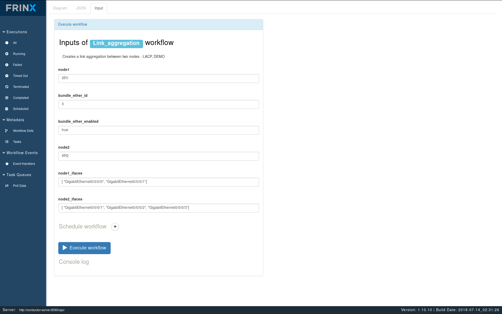
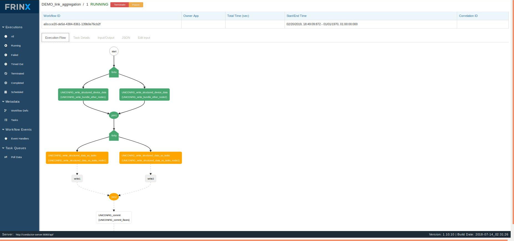

# LACP workflow using FRINX Machine

This workflow is using uniconfig to create LAG interface on two nodes and assign the bundle id to given interfaces on both nodes.

**Supported device**: ios-xr mounted as a cli device

### Creating a link aggregation between two nodes

In the next step we will create a link between node 1 and node 2.

Click on:

 * Metadata
   * Workflow Defs

Then select the workflow: **Link_aggregation**

**Example of input parameters**:

After providing input parameters, you can execute the workflow.

### Workflow execution

After workflow execution, you will be presented with representing diagram.

The workflow diagram in progress will color the steps according to the progress.

**NOTE**: Diagram with progress of the workflow can be updated by hiting F5 key.

Diagram displayed above shows the workflow has been successfully completed.
