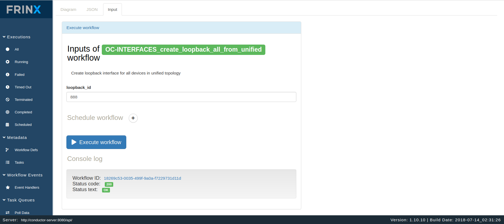
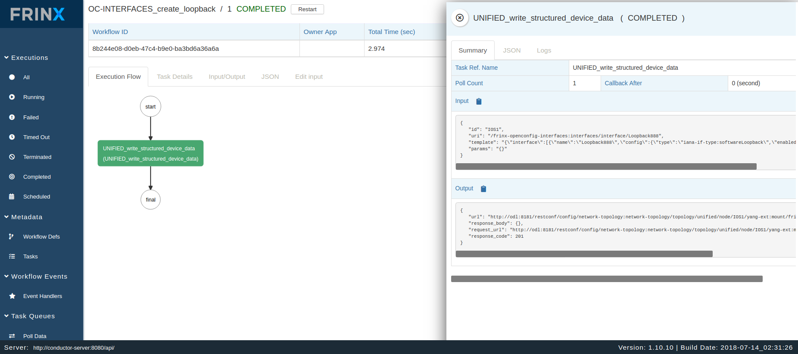
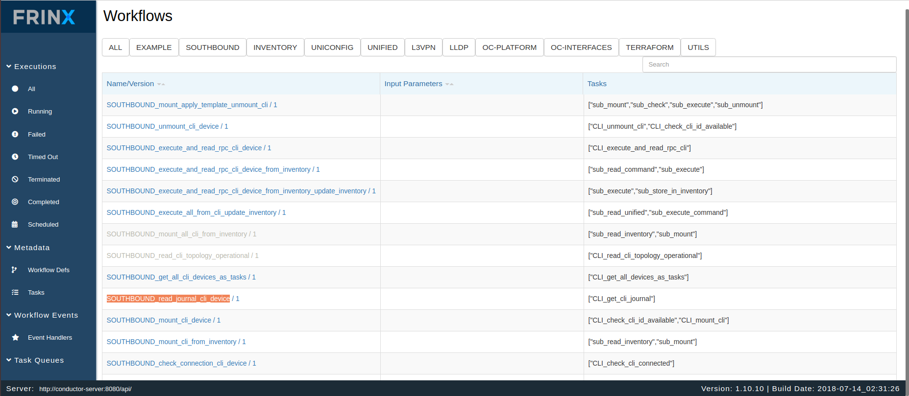
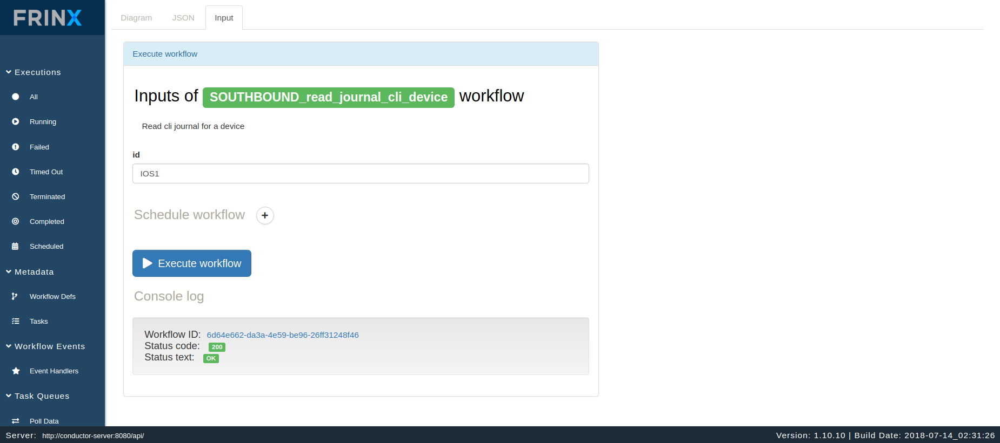
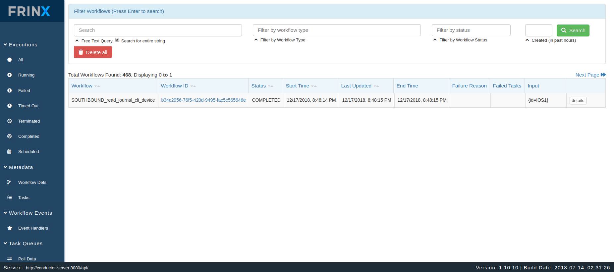
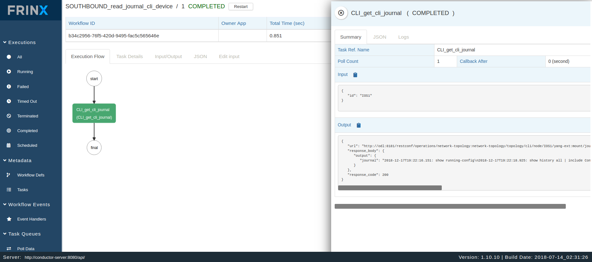

## Running workflows to create loopback address on devices and check the journal.

In this section we show how users can execute workflows to create loopback address on devices stored in the inventory.
 

### Create loopback address on devices stored in the inventory

In the next step we will execute a workflow that creates loopback on every mounted device from inventory.

Click on:

* Metadata
  * Workflow Defs

Then select the workflow:
**OC-INTERFACES_create_loopback_all_from_unified**

After providing the loopback id to be used, you can execute the workflow.

Under

* Executions
  * All

You can see the progress of the workflow, input/output data of each task and statistics associated with the workflow execution.

The workflow creates a loopback for all devices in the inventory. Here you see all the devices.

After the main and sub-workflows have completed successfully the loopback addres was created on the devices.
Since we are working with emulated devices, we can check a device journal ro see if it was really created.

The execution of all workflows can be manually, via the UI, or can be automated and scheduled via the REST API of conductor server.

### Running the workflow for retrieving the journal of a device

In this section we show how to run the workflow for retrieving the journal of a device.

Click on:

* Metadata
  * Workflow Defs

Then select the workflow:
**SOUTHBOUND_read_journal_cli_device**

After providing the device id(you need to specify the id under you mounted the device), you can execute the workflow.

Under

* Executions
  * All

You can see the progress of the workflow, input/output data of each task and statistics associated with the workflow execution.

The journal information can be found in the output of the workflow. To transform to a readable format you need to unescape the line.

