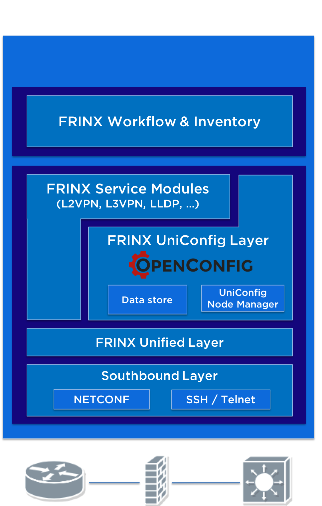

# FRINX Machine User Guide

FRINX Machine is a dockerized deployment of

* **FRINX Opendaylight** (network automation solution)

* and **Netflix Conductor** (workflow engine)

* **Elasticsearch** (inventory and log data)

**The goal is to provide a platform enabling easy definition, execution and monitoring of complex workflows using FRINX Opendaylight.**

In this deployment, responsibilities are separated as follows:

* Opendaylight is used for:

    * Connecting to the devices in network

    * Keeping connections between devices alive

    * Pushing configuration data to devices

    * Pulling configuration and operational data from devices

* Conductor is used for:

    * Chaining atomic tasks into complex workflows

    * Defining, executing, and monitoring workflows (via REST or UI)
  
* Elasticsearch is used for:
  
    * Storing inventory data
  
    * Storing log data

An example workflow could consist of:

1. Pulling device IP and mgmt credentials from an external IPAM system

2. Mounting a device

3. Verifying the device is connected

4. Executing a configuration template

5. Unmounting a device

We chose Netflix’s conductor workflow engine since it has been proven to be highly scalable open-source technology that integrates very well with FRINX Opendaylight. Further information about conductor can be found at:

* **Github**: [https://github.com/Netflix/conductor](https://github.com/Netflix/conductor)

* **Docs:** [https://netflix.github.io/conductor/](https://netflix.github.io/conductor/)

## High Level Architecture

Following diagram outlines main functional components in the FRINX Machine solution:

 

The following diagram outlines the container components of the FRINX Machine solution:

 

FRINX Machine repository is available at: [https://github.com/FRINXio/FRINX-machine](https://github.com/FRINXio/FRINX-machine)

Frinx-conductor repository is available at: [https://github.com/FRINXio/frinx-conductor](https://github.com/FRINXio/frinx-conductor)

Specialized ODL tasks are available at: [https://github.com/FRINXio/netinfra_utils](https://github.com/FRINXio/netinfra_utils) 

## Defining a workflow

Workflows are defined using a JSON based domain specific language (DSL) by wiring a set of tasks together. The tasks are either control tasks (fork, conditional etc) or application tasks (e.g. encode a file) that are executed on a remote machine.

FRINX Machine distribution comes in with number of pre-packaged workflows.

Detailed description of workflow and task definitions along with examples can be found at official [Netflix Conductor documentation](https://netflix.github.io/conductor/metadata/#workflow-definition).

## Starting a workflow

Open **conductor-ui** at *host:5000 *and navigate to **_Metadata > Workflow Defs_**, there is a list of all available workflow definitions, choose one and switch to tab **_Input_**.

### Input

Workflows are supplied inputs by client when a new execution is triggered. Workflow input is a JSON payload that is available via ${workflow.input...} expressions.

Each task in the workflow is given input based on the inputParameters template configured in workflow definition. inputParameters is a JSON fragment with value containing parameters for mapping values from input or output of a workflow or another task during the execution.

### Start workflow

Fill in JSON generated input fields. Input fields may contain default value or description provided in workflow definition. 

Press the button **_Execute workflow_** in order to start current workflow. 

**Console log** provides status information about workflow execution.

Executed workflows can be found at **_Executions_** tab in left menu.

## Inspecting executed workflows 

Navigate to **_Executions > All_**, where you are able to search and filter for specific workflows.

After clicking on specific workflow, you are able to see its details including outputs as well as other information about current workflow.

### Workflow actions 

Workflow actions are available after clicking on specific executed workflow. 

You are able to: **_terminate, rerun, restart, retry, pause or resume_** specific workflow. 

If you want to run previously executed workflow as new workflow with same or edited inputs, navigate to **Edit Input** tab, where you are able to edit specific inputs and run workflow again.

## Use Cases

### Running workflows to obtain platform inventory data

In this section we show how users can execute workflows to obtain platform inventory data from devices in the network and to store them in the inventory (Elasticsearch).

The goal of this use case is to collect inventory information about physical devices via their vendor specific NETCONF or CLI interfaces, convert this information into OpenConfig data structures and store the resulting information as a child entry to its associated parent in Elasticsearch. The outcome is that users can manage their physical network inventory (line cards, route processors, modules, transceivers, etc …) across different hardware vendors in real-time via a single uniform interface.

#### Create a new device in the inventory

In our first workflow we will create a device entry in our inventory via the FRINX workflow UI. Many customers will choose to import bulk data from other data sources like Excel or CSV files. Many data import tools exist for Elasticsearch (e.g. [https://github.com/knutandre/excelastic](https://github.com/knutandre/excelastic)). The import of bulk data is out of scope for this use case. We rather focus on data input via our GUI to demonstrate a simple set of workflows.

Click on "Metadata → Workflow Defs" and select the workflow called “INVENTORY_add_cli_device”. Select the tab “Input” and fill out the form. 

After you have filled out the form click on "Execute Workflow". You should see a similar response like the one shown below.

After successful execution of our first workflow, we can see the the new device created in Elasticsearch. 

#### Mount the new device in FRINX OpenDaylight

Next we want to mount the device in ODL. The mount operation for NETCONF or CLI devices in ODL results in a permanent connection that is established, maintained and if necessary re-established with the device. Once a device is mounted in FRINX OpenDaylight, it can be accessed via the UniConfig framework for reading and writing configuration and operational data. The next workflow will mount the device in FRINX ODL. 

Click on "Metadata → Workflow Defs" and select the workflow to mount a single device: “SOUTHBOUND_mount_cli_from_inventory”

If you want to mount multiple devices from the inventory choose the workflow "SOUTHBOUND_mount_all_cli_from_inventory". 

Fill out the ID of the device for a single device or fill out the optional field "type" to specify which type of device you want to mount (e.g. “ios”, “io xr”, ...).  In our case the ID is “ASR9000” to mount a single device. After you clicked on “Execute workflow” you should see a similar view like the one below:

Now we will look how the workflows are executing and how we can check if they have succeeded. The workflow that we have executed will spawn a number of sub workflows and will only show completed if all sub workflows have completed successfully. You can verify the state of main and sub-workflows in this view. Click on "Executions → All" to see the status of each workflow.

In this view, we can see that all workflows have completed successfully. After the main workflow was executed it has spawned of multiple sub workflows until the last workflow checks if the device was successfully mounted. The following screenshots show additional information about the sub-workflows that is relevant to analysis and troubleshooting. 

Once the main workflow has successfully completed the device is mounted and can now be used to get information from the device or configure the device. 

#### Collect platform information from the device and store in the inventory

In the next step we will execute a workflow that collects platform information from every mounted device, converts the vendor specific information into OpenConfig format and writes the resulting data to the inventory.

Click on “Metadata → Workflow Defs” and select the workflow: “PLATFORM_read_components_all_from_unified_update_inventory”

Once selected, you can execute the workflow without providing additional information.

Under “Executions → All” you can see the progress of the workflow, input/output data of each task and statistics associated with the workflow execution.

After the main and sub-workflows have completed successfully the platform information is now stored in the inventory as a child entry to the device ID that the information comes from.

The execution of all workflows can be manually, via the UI, or can be automated and scheduled via the REST API of conductor server.

## Running workflows to obtain LLDP topology data

In this section we will show you how to run workflows to collect LLDP (Link Layer Discovery Protocol) information and store that information in the inventory (Elasticsearch).

The goal of this workflow is to collect LLDP information from different networking devices, reconcile that information into a single topology based on the IETF topology data model, store it and finally transform it in a dot G notation to allow for visualization.

Together with FRINX Machine, we ship sample topologies that allow you to explore our workflows without the need to provide access your own networking devices. 

### Create a new device in the inventory

In our first workflow we will create a device entry in our inventory via the FRINX workflow UI. We have prepared workflows that will help you to enter the information for the devices available in our sample-topology. 

Click on "Metadata → Workflow Defs" and under the category "EXAMPLES" select the workflow called "EXAMPLE_add_leafspine_device". Select the tab "Input" and verify that the form is pre-filled with defaults for the first device "L1". The form should look similar to this:

Click on the "Execute Workflow" button and you should see a console log message indicating the workflow ID and the status "OK".

Now enter the next device "L2" in the id field and also enter the port number for device L2. You can find the port number in the description of the port field. The port number for L2 is 11001. After you have entered id and port fields click the "Execute workflow" button again.

Continue to enter the data for all seven devices L1, L2, L3, L4, L5, S1 and S2 with the following port numbers:

<table>

  <tr>

   <td>Device ID

   </td>

   <td>Port Number

   </td>

  </tr>

  <tr>

   <td>L1

   </td>

   <td>11000

   </td>

  </tr>

  <tr>

   <td>L2

   </td>

   <td>11001

   </td>

  </tr>

  <tr>

   <td>L3

   </td>

   <td>11002

   </td>

  </tr>

  <tr>

   <td>L4

   </td>

   <td>11003

   </td>

  </tr>

  <tr>

   <td>L5

   </td>

   <td>11004

   </td>

  </tr>

  <tr>

   <td>S1

   </td>

   <td>12000

   </td>

  </tr>

  <tr>

   <td>S2

   </td>

   <td>12001

   </td>

  </tr>

</table>

After you have entered all devices, go to Kibana and show the data under the index pattern "inventory". If you are using Kibana for the first time, you will have to create a new index pattern called "inventory". 

To create a new index pattern click on "Management" in the left hand side bar, select "Index Patterns" and click on the button "Create Index Pattern". Enter "inventory" in the index pattern field and click "Create". 

Now click on "Discover" in the left hand side bar and you should see all devices that you have entered in the step before. You should see a view similar to the following:

### Mount the devices in FRINX OpenDaylight

Next we want to mount the devices in ODL. The mount operation for NETCONF or CLI devices in ODL results in a permanent connection that is established, maintained and if necessary re-established with the device. Once a device is mounted in FRINX OpenDaylight, it can be accessed via the UniConfig framework for reading and writing of configuration and operational data. The next workflow will mount the device in FRINX ODL. 

Click on "Metadata → Workflow Defs" and select the workflow to mount all devices that are in the inventory: "SOUTHBOUND_mount_all_cli_from_inventory"

The workflow requires no additional parameter to run. After you have clicked "Execute workflow" you should see a view similar to this:

. 

The workflow will only finish successfully if all devices have been mounted to FRINX ODL. You can verify that all devices are successfully connected by running the following workflow:

 Click on "Metadata → Workflow Defs" and select: "SOUTHBOUND_read_cli_topology_operational"

Execute the workflow and you should see a view similar to the following:

Now click on the workflow ID. In the graphical representation of the workflow, click on the green box with the workflow name to see details about the workflow output. You should see a similar view like this:

The workflow output shows the status of all devices and you can verify that the devices have been connected successfully.
