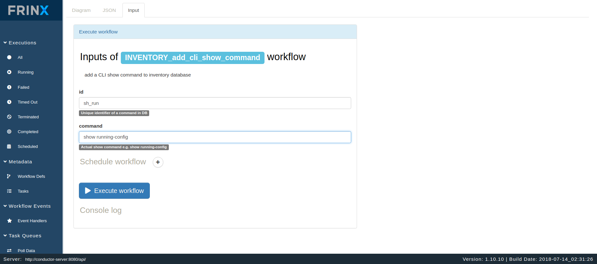
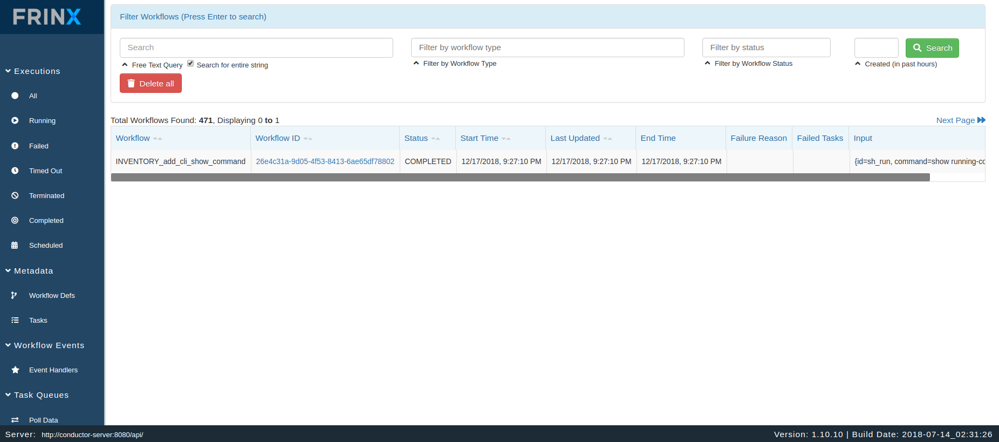
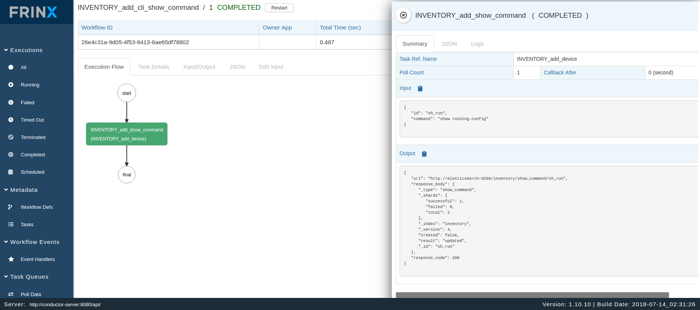
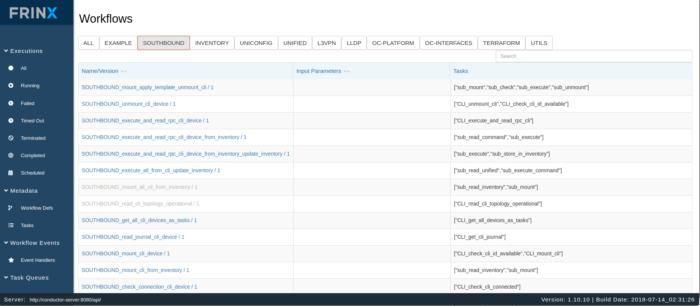
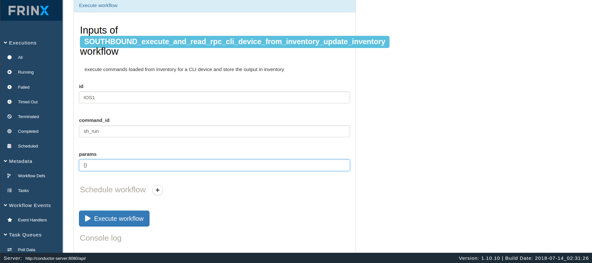
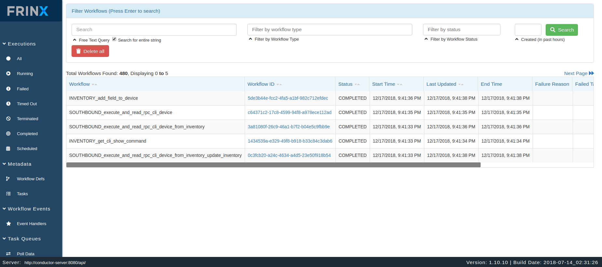
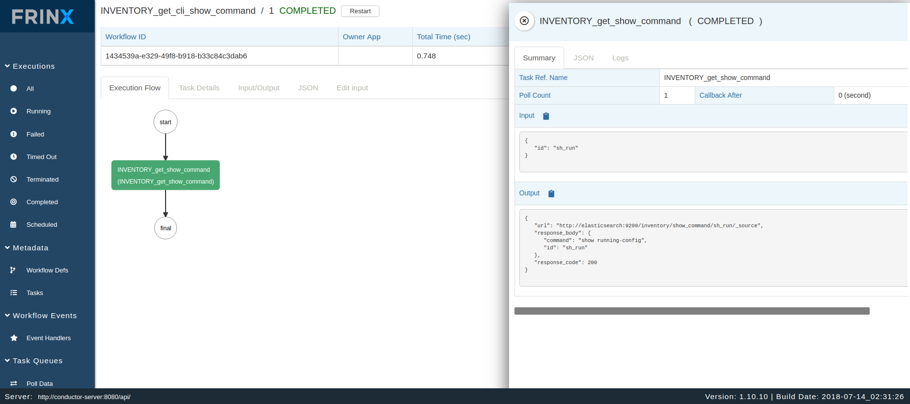
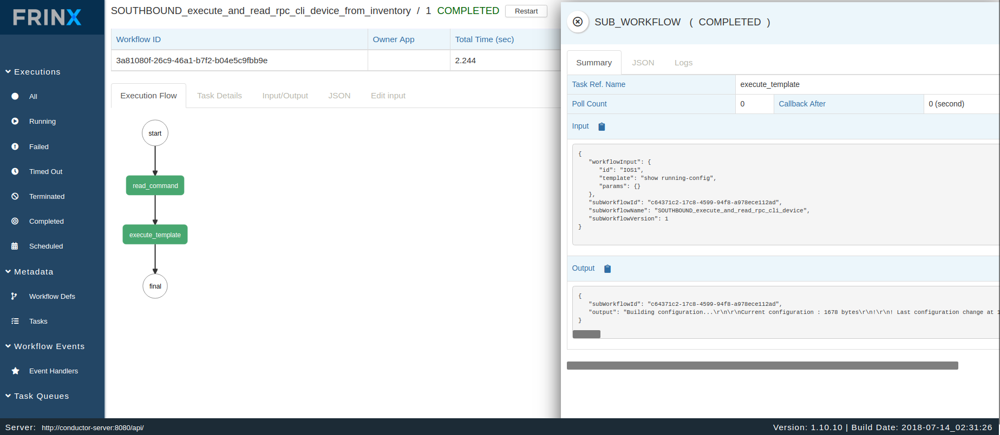
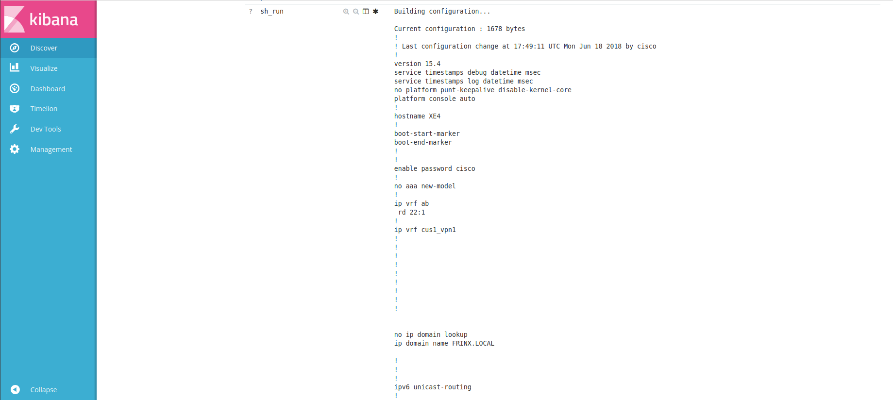

.. role:: raw-html-m2r(raw)
   :format: html

Running workflows to execute saved command on devices
=====================================================

In this section you will see how users can save a command to inventory and run it on devices. The command in this case is platform specific.

The goal of this use case is to execute a saved command on devices and save to output in the inventory.

Save a command to inventory
---------------------------

In the next step we will execute a workflow that saves a command to inventory under a specific id.

Click on:

* Metadata

  * Workflow Defs

Then select the workflow:\ :raw-html-m2r:` `
**INVENTORY_add_cli_show_command**

.. image:: image1.png
   :target: image1.png
   :alt: preview10

Once you fill in the id and the commmand you want to save, continue to execute the workflow.

Under

* Executions

  * All

You can see the progress of the workflow, input/output data of each task and statistics associated with the workflow execution.

After the succesful completion of the workflow the command is saved in the inventory.

.. image:: image5.png
   :target: image5.png
   :alt: preview10

Execute saved command on mounted devices
----------------------------------------

In the next step we will execute the saved command on devices and obtain the running configuration which we then save to the inventory.

To run the command on one device in the inventory use:
**SOUTHBOUND_execute_and_read_rpc_cli_device_from_inventory_update_inventory**

To run the command on all mounted devices in the inventory use:
**SOUTHBOUND_execute_all_from_cli_update_inventory**

We will now run the workflow for one device.

Click on:

* Metadata

  * Workflow Defs

To run the command on one device in the inventory use:
**SOUTHBOUND_execute_and_read_rpc_cli_device_from_inventory_update_inventory**

After specifying the device id, the command id, and the input paramaeters(in our case empty: {}) you can run the workflow.

Under

* Executions

  * All

Now you can see the progress of the workflow, input/output data of each task and statistics associated with the workflow execution.

.. image:: image11.png
   :target: image11.png
   :alt: preview10

.. image:: image12.png
   :target: image12.png
   :alt: preview10

After succesful completion of the workflow, the command is saved in the inventory.

The execution of all workflows can be done manually, via the UI, or can be automated and scheduled via the REST API of conductor server.
